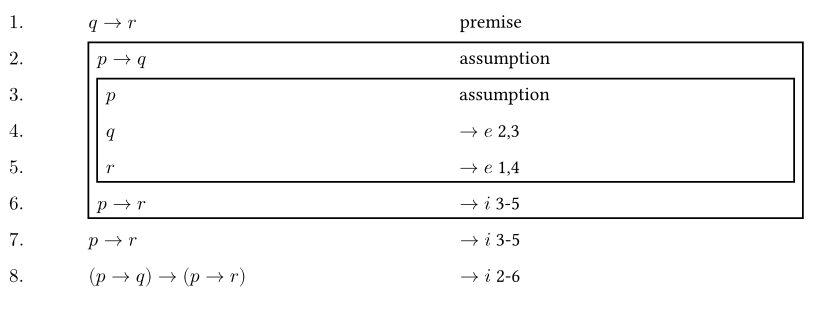

# Formal-Methods-Typst

用于书写形式化中数理逻辑证明题

样例：

```
#proof(8,                 // 总行号
  $q->r$, [p],            // premise 的缩写形式 [p]
  [+], 5,                 // 建立一个持续 5 行的 assuption
  $p->q$, [a],            // assumption 的缩写形式 [a]
  [+], 3,                 // 建立一个持续 3 行的 assuption
  $p$, [a],
  $q$, [$-> e$ 2,3],
  $r$, [$-> e$ 1,4],
  $p->r$, [$-> i$ 3-5],
  $(p->q)->(p->r)$, [$-> i$ 2-6],
)
```



**Warning: 不支持换页排版，请自行换页**
