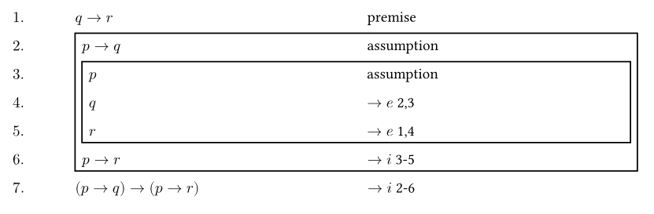
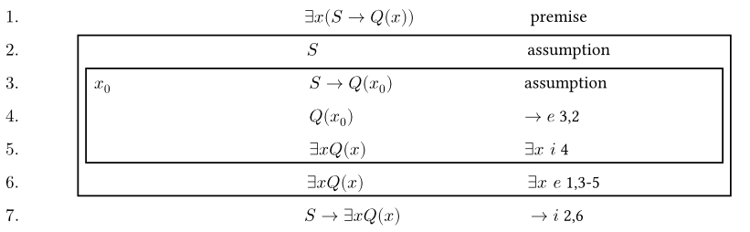

# Formal-Methods-Typst

用于书写形式化中数理逻辑证明题

样例：

```
#proof(
  $q->r$, [p],            // premise 的缩写形式 [p]
  [+], 5,                 // 建立一个持续 5 行的 assuption
  $p->q$, [a],            // assumption 的缩写形式 [a]
  [+], 3,                 // 建立一个持续 3 行的 assuption
  $p$, [a],
  $q$, [$-> e$ 2,3],
  $r$, [$-> e$ 1,4],
  $p->r$, [$-> i$ 3-5],
  $(p->q)->(p->r)$, [$-> i$ 2-6],
)
```



```
#proof(
  $forall x not P(x)$, [p],
  [+], 5,
  $exists x P(x)$, [a],
  [+], 3,
  $x_0$, [x],                            // 建立一个任意变量 x_0，该变量的声明将和下一行一起显示
  $P(x_0)$,[a],
  $not P(x_0)$, [$forall x space e$ 1],
  $bot$, [$not e$ 3,4],
  $bot$, [$exists e$ 2,3-5],
  $not exists x P(x)$, [$not i$ 2-6]
)
```



## 使用方法

基础用法：

```
#proof($公式1$, [规则1], $公式2$, [规则2], $公式3$, [规则3], ...)
```

规则简写：

```
[p] = premise
[a] = assumption
[x] = new variable
```

其他简写：

```
[+] = new block
```

定义一个 assumption 块（作用域）：

```
#proof(
  ...
  [+], 作用域大小,
  $作用域中的公式1$, [作用域中的规则1],
  ...
)
```

定义一个变量，并令该变量的声明和公式 n 处于同一行：

```
#proof(
  ...
  $变量名$, [x],
  $公式n$, [规则n],
  ...
)
```

定义一个变量，该变量的声明位于单独一行：

```
#proof(
  ...
  $变量名$, [x],
  $$, [],
  ...
)
```


**Warning: 不支持换页排版，请自行换页**
